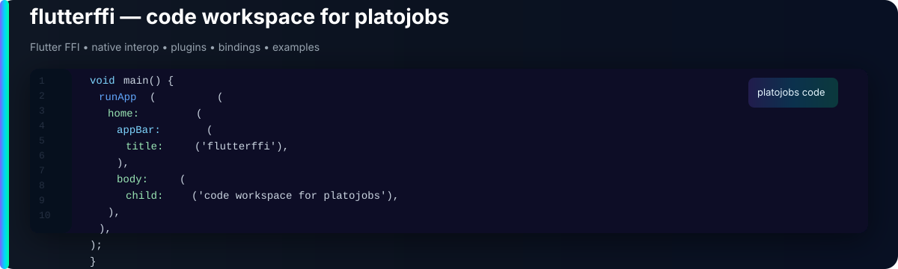

  

<table width="100%">
  <tr>
    <td width="64%" valign="middle">
      <h1>flutterffi</h1>
      <h3>Code archive and engineering workspace for <a href="https://github.com/platojobs">@platojobs</a></h3>
      

        This account is used to publish focused repositories, platform experiments, and implementation references for apps, developer tooling, native integration, and frontend systems.
      

    </td>
    <td width="36%" valign="middle" align="right">
      

        <a href="https://github.com/platojobs"><strong>Main account</strong></a> 
        <a href="https://github.com/flutterffi">Repository archive</a> 
        <a href="https://github.com/flutterffi?tab=repositories">Browse repositories</a>
      

    </td>
  </tr>
</table>

  
  
  
  
  
  

## Repository Snapshot

<table width="100%">
  <tr>
    <td width="50%" align="center">
      
    </td>
    <td width="50%" align="center">
      
    </td>
  </tr>
  <tr>
    <td colspan="2" align="center">
      
    </td>
  </tr>
</table>

This profile is intentionally repository-first. For identity, long-form work, and broader activity, start from <a href="https://github.com/platojobs">@platojobs</a>; use this account as the source archive for platform-specific code and experiments.

## Workspace

- **Mobile:** Flutter, Dart, Swift, Objective-C, Kotlin, FFI
- **Frontend:** Vue 3, TypeScript, HTML, CSS
- **Backend:** Python, Go, GraphQL, REST APIs
- **Architecture:** Bloc, Riverpod, Clean Architecture, Microservices

## Current Focus

- Advanced Flutter architecture patterns
- Native iOS and Android integration
- Vue 3 and TypeScript frontend systems
- Go microservices and API design
- Python automation workflows
- Cross-platform UI engineering
