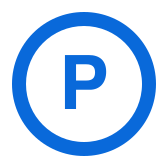

<table width="100%">
  <tr>
    <td width="64%" valign="middle">
      
      <h3>Code archive and engineering workspace for <a href="https://github.com/platojobs">@platojobs</a></h3>
      

        This account is used to publish focused repositories, platform experiments, and implementation references for apps, developer tooling, native integration, and frontend systems.
      

    </td>
    <td width="36%" valign="middle" align="center">
      
      <h3><a href="https://github.com/platojobs">@platojobs</a></h3>
      

        Main account. Product work, code notes, and engineering updates.
      

      

        <a href="https://github.com/platojobs"><strong>Profile</strong></a>
        ·
        <a href="https://github.com/flutterffi?tab=repositories">Archive</a>
        ·
        <a href="https://flutterffi.github.io/">Web</a>
      

    </td>
  </tr>
</table>

## Repository Snapshot

  

This profile is intentionally repository-first. For identity, long-form work, and broader activity, start from <a href="https://github.com/platojobs">@platojobs</a>; use this account as the source archive for platform-specific code and experiments.

<table width="100%">
  <tr>
    <td width="50%" valign="top">
      
      <h2>Workspace</h2>
      <ul>
        <li><strong>Mobile:</strong> Flutter, Dart, Swift, Objective-C, Kotlin</li>
        <li><strong>Frontend:</strong> Vue 3, TypeScript, HTML, CSS</li>
        <li><strong>Backend:</strong> Python, Go, GraphQL, REST APIs</li>
        <li><strong>Architecture:</strong> Bloc, Riverpod, Clean Architecture, Microservices</li>
      </ul>
    </td>
    <td width="50%" valign="top">
      
      <h2>Current Focus</h2>
      <ul>
        <li>Advanced Flutter architecture patterns</li>
        <li>Native iOS and Android integration</li>
        <li>Vue 3 and TypeScript frontend systems</li>
        <li>Go microservices and API design</li>
        <li>Python automation workflows</li>
        <li>Cross-platform UI engineering</li>
      </ul>
    </td>
  </tr>
</table>
